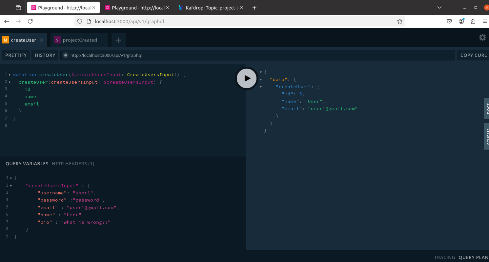
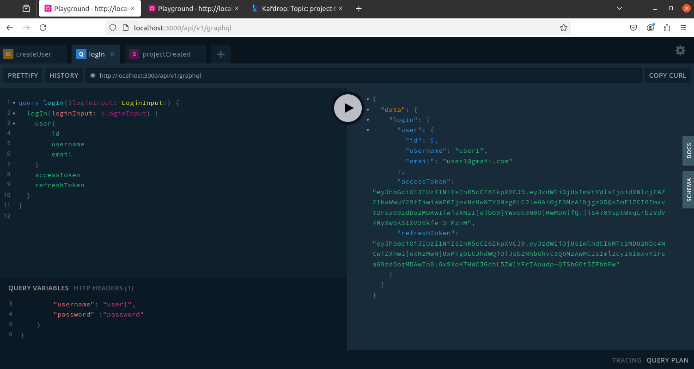
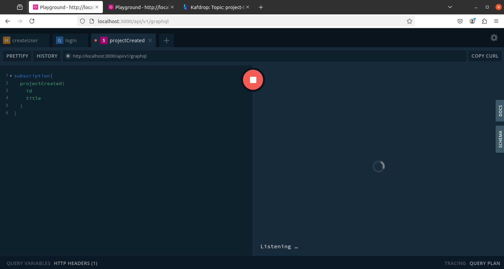
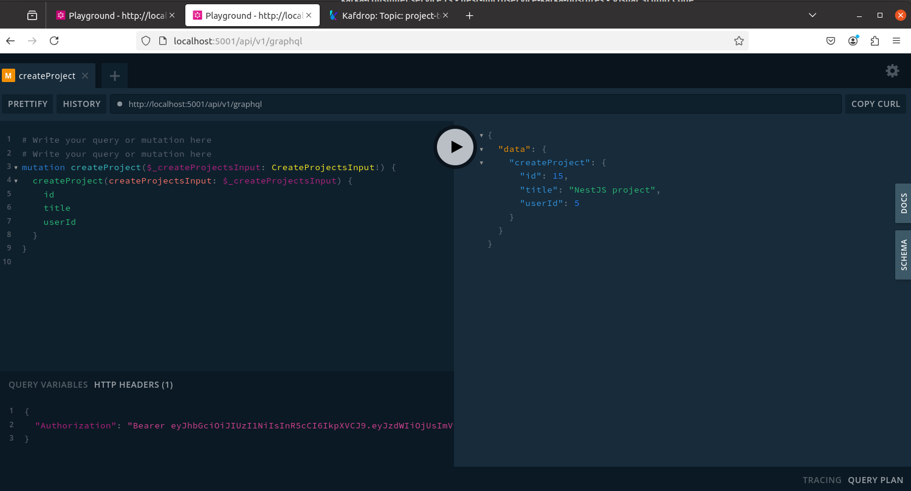
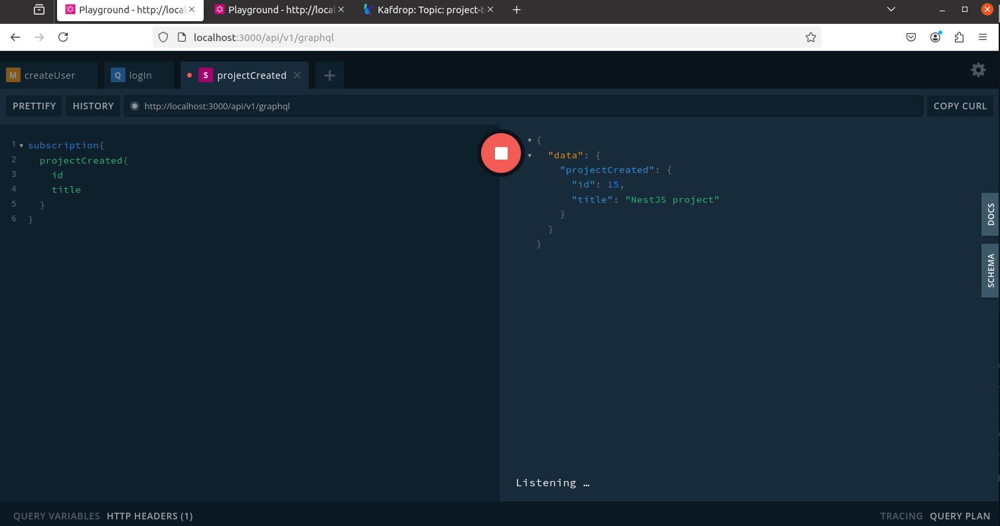
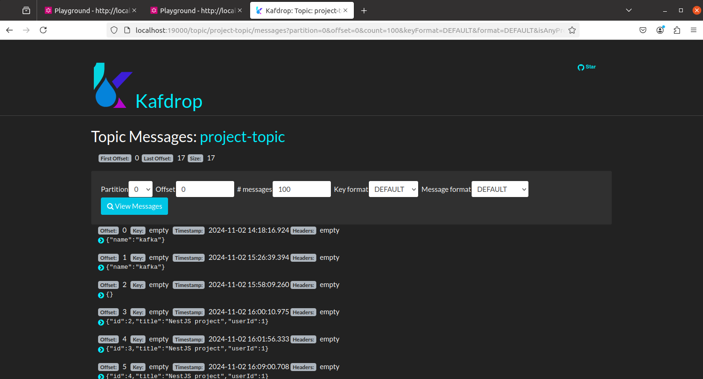
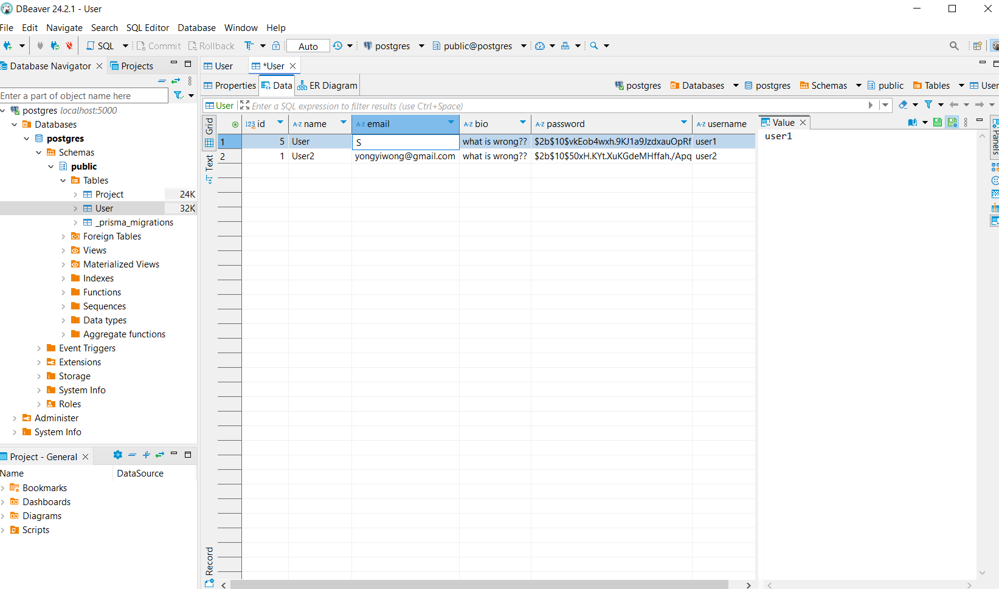
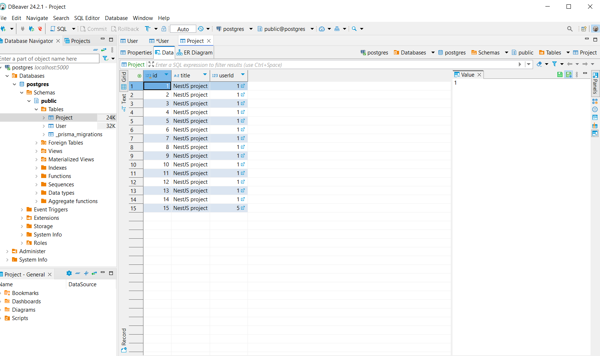

## Description

There are 2 microservices communicating over kafka.

Each microservice is developed by nestjs, graphql, postgresql

Microservice account listens to localhost:3000 while microservice project listens to localhost:5001

Microservice project will check if a user is logged in or not via graphql communication to microservice account.

<b>Short description:</b>

User A creates an account and login with his credential via JWT token.

He subscribes new project via graphql subscription.

User B creates an account and login.

User B creates a project and user A will subscribe his project.

## How to test

Unfortunately, postman doesn't support WebSocket or subscription queries. so tested using GraphQL playground
- Create user 
    
- Login
    
- Subscribe new project
    
- Create new project
    
- Check subscription
    
- Check kafka communication
    
- Table User
    
- Table Project
    

